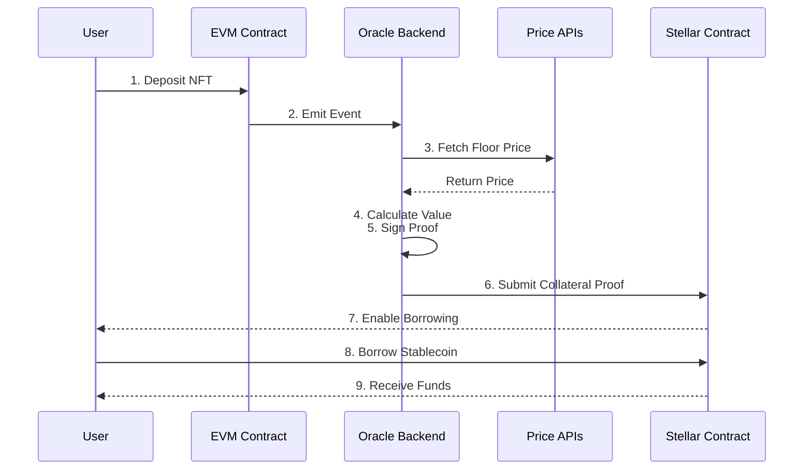
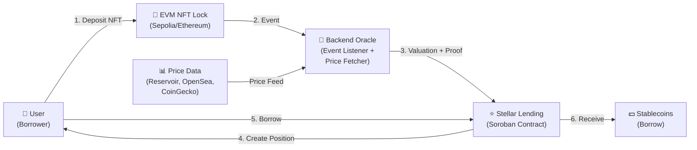
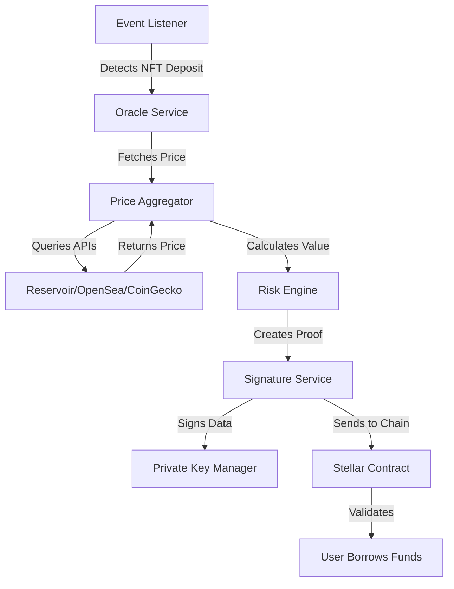
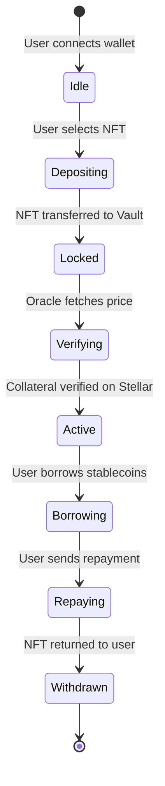

# NFTxLend 🚀

**Cross-chain NFT-backed lending protocol** — Lock NFTs on EVM chains, borrow stablecoins on Stellar

[](https://opensource.org/licenses/MIT)

---

## 📋 What is NFTxLend?

**NFTxLend** is a decentralized lending protocol that allows users to:
1. **Lock NFTs** on an EVM blockchain (Ethereum, Sepolia)
2. **Get valuations** through a decentralized oracle system
3. **Borrow stablecoins** on the Stellar network using NFT collateral

This is a **cross-chain DeFi protocol** showcasing advanced smart contract engineering, oracle architecture, and blockchain integration.

### Core Value Proposition
- 🔒 **Secure Collateral**: NFTs locked in smart contracts
- 💰 **Access Liquidity**: Borrow against NFT value without selling
- ⛓️ **Cross-Chain**: Deposit on EVM, borrow on Stellar
- 📊 **Fair Pricing**: Decentralized oracle for accurate NFT valuations

---

## 🏗️ How It Works

### User Journey Flow



### Architecture Overview



---

## 🔧 Tech Stack

### **Smart Contracts (EVM)**
- **Language**: Solidity
- **Framework**: Foundry
- **Libraries**: OpenZeppelin
- **Network**: Sepolia Testnet

### **Smart Contracts (Stellar)**
- **Language**: Rust
- **Framework**: Soroban SDK
- **Network**: Stellar Testnet

### **Backend**
- **Runtime**: Node.js
- **Framework**: NestJS
- **Database**: PostgreSQL / MongoDB
- **Cache**: Redis (optional)
- **Task Scheduler**: Cron Jobs

### **Frontend (Coming Soon)**
- **Framework**: React
- **Language**: TypeScript
- **Styling**: TailwindCSS
- **Web3**: ethers.js, Stellar SDK
- **Wallet**: wagmi / RainbowKit

---

## 📦 Project Structure

```
NFTxLend/
├── contracts/
│   ├── EVM/                    # Ethereum/Sepolia contracts
│   │   ├── src/
│   │   │   ├── NFTxLendRouter.sol      # Main routing contract
│   │   │   ├── Vault.sol               # NFT vault & collateral storage
│   │   │   ├── OracleVerifier.sol      # Oracle signature verification
│   │   │   └── interfaces/             # Contract interfaces
│   │   ├── test/               # Foundry tests
│   │   ├── script/             # Deployment scripts
│   │   └── foundry.toml        # Foundry config
│   │
│   └── Soroban/                # Stellar Soroban contracts
│       ├── contracts/
│       │   └── hello-world/    # Example contract
│       ├── Cargo.toml
│       └── README.md
│
├── arch.md                     # Detailed architecture document
├── README.md                   # This file
└── LICENSE                     # MIT License
```

---

## 🔐 Smart Contracts

### EVM Side (Collateral Management)

#### **Vault.sol**
Manages NFT deposits and collateral positions
- Store locked NFTs safely
- Track position ownership
- Enable withdrawals after repayment

#### **OracleVerifier.sol**
Verifies oracle signatures and valuations
- Validate oracle-signed price data
- Prevent malicious price feeds
- Store verified valuations

#### **NFTxLendRouter.sol**
Main entry point for user interactions
- Coordinate deposits and borrowing
- Route transactions between contracts
- Manage user permissions

### Stellar Side (Lending)

**Soroban Smart Contract** (Rust)
- Create borrowing positions
- Track debt obligations
- Handle repayments
- Unlock collateral eligibility

---

## 🌊 Oracle Architecture

The backend oracle is the **critical component** that bridges EVM and Stellar:



### Oracle Responsibilities
✅ Listen to EVM events  
✅ Fetch NFT floor prices from multiple sources  
✅ Calculate collateral value  
✅ Sign oracle proofs (non-custodial)  
✅ Relay data to Stellar contract  
✅ Handle risk parameters (LTV, liquidation threshold)

---

## 🚀 Getting Started

### Prerequisites
- Node.js 18+
- Foundry (for EVM contracts)
- Rust (for Soroban contracts)
- Git

### EVM Contracts Setup

```bash
cd contracts/EVM
forge install
forge build
forge test
```

### Soroban Contracts Setup

```bash
cd contracts/Soroban
cargo build --target wasm32-unknown-unknown --release
cargo test
```

### Deploy

#### Sepolia Testnet (EVM)
```bash
cd contracts/EVM
forge script script/DeployNFTxLend.s.sol --rpc-url $SEPOLIA_RPC_URL --private-key $PRIVATE_KEY --broadcast
```

#### Stellar Testnet
```bash
cd contracts/Soroban
soroban contract build
soroban contract deploy --network testnet
```

---

## 💡 How Collateral Works



---

## 📊 Risk Parameters

The oracle calculates risk metrics:

| Parameter | Purpose | Example |
|-----------|---------|---------|
| **LTV** (Loan-to-Value) | Max borrow ratio | 50% |
| **Liquidation Threshold** | When position gets liquidated | 80% |
| **Collateral Haircut** | Safety margin | 10% |

---

## 🧪 Testing

### EVM Tests
```bash
cd contracts/EVM
forge test -v
forge coverage
```

### Soroban Tests
```bash
cd contracts/Soroban
cargo test
```

---

## 🔗 Networks

### Development
- **EVM**: Sepolia Testnet
- **Stellar**: Stellar Testnet

### Mainnet (Future)
- **EVM**: Ethereum Mainnet
- **Stellar**: Stellar Public Network

---

## 📚 Documentation

- **[arch.md](./arch.md)** — Detailed architecture & design decisions
- **[EVM README](./contracts/EVM/README.md)** — Smart contract docs
- **[Soroban README](./contracts/Soroban/README.md)** — Soroban contract docs

---

## 🤝 Contributing

This is a portfolio project. For improvements or questions, please open an issue.

---

## 📄 License

MIT License — see [LICENSE](./LICENSE) file

---

## 👨‍💻 Technical Highlights

✨ **Cross-chain architecture** — EVM ↔ Stellar via oracle  
✨ **Decentralized oracle** — Multi-source price feeds with signature verification  
✨ **Non-custodial** — Oracle signs data, doesn't hold assets  
✨ **Scalable** — Foundry + Soroban for fast iteration  
✨ **Well-tested** — Comprehensive test suites for both chains

---

**Questions?** Check [arch.md](./arch.md) for detailed architecture documentation.
